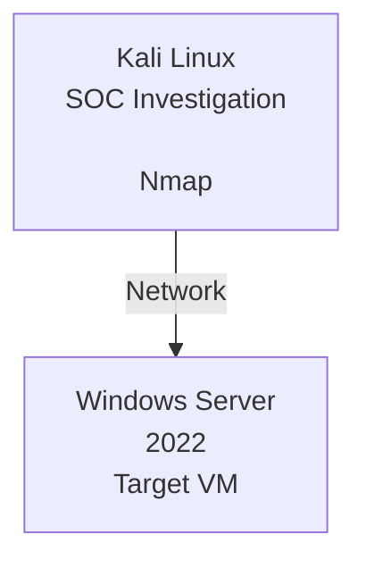

# Network Reconnaissance Against Windows Server 2022
A hands-on lab demonstrating network reconnaissance, port scanning, service enumeration, and controlled attack simulation against a target Windows Server 2022 VM using Nmap as the network reconnaissance tool.

## Overview
This project simulates a controlled security assessment in an isolated environment.

An attacker Kali Linux VM performing Network Reconnaissance using Nmap on a Windows Server 2022 VM as the target.
The primary objective of the project is to understand how an attacker discovers exposed network services using Nmap and how the resulting information can be documented from a SOC analysis percpective.

The project focuses exclusively on Nmap-based Network Reconnaissance and Attack simultion.

## Objective
The objectives of this assessment were:
- Discover exposed TCP ports
- Identify running services
- Enumerate service versions
- Perform OS detection
- Perform targeted service enumeration
- Identify security weakness or unnecessary exposure
- Preserve scan results as investigation evidence
- Analyzing the findings from a SOC analyst perspective
- Document the complete investigation in a security report

## Lab Environment
|Component|Details|
|:-------:|:-----:|
|Analyst/Attacker|*Kali Linux*|
|Target|*Windows Server 2022*|
|Tool|*Nmap*|
|Virtualisation|*VirtualBox*|
|Network|*NAT Network*|
|Assessment Type|*Network Reconnaissance & Service Enumeration*|

### Lab Architecture


## Tools
- Nmap
- Kali Linux
- Windows Server 2022
- VirtualBox

## Methodology
The investigation followed a progressive network reconnaissance workflow.

Each stage was performed based on information obtained from previous stage.

## Nmap Commands & Scan Results
### 1. Host Discovery
**Command**
```
nmap -sn <TARGET_IP>
```
**Purpose**

The host discovery scan was used to determine whether the Windows Server was reachable from the Kali Linux analyst machine.

**Result**

The target was identified as an active host and was therefore selected for further network enumeration.

**Evidence:** [host_discovery.txt](./scans/host_discovery.txt)

### 2. Initial Port Scan
**Command**
```
nmap <TARGET_IP>
```
**Purpose**

The initial Nmap scan was used to identify commonly exposed TCP services and establish an initial view of the target's network attack surface.

**Result**

The scan identified the following open TCP ports:
|Port|State|Service|
|:--:|:---:|:-----:|
|5357/tcp|**Open**|WSDAPI|
|5985/tcp|**Open**|WinRM|

**No commonly exposed services such as HTTP (80), HTTPS (443), SSH (22), SMB (445), or RDP (3389) were observed during this scan.*

**Evidence:** [basic_tcp_port_scan.txt](./scans/basic_tcp_port_scan.txt)

### 3. Full TCP Port Scan
**Command**
```
nmap -p- <TARGET_IP>
```
**Purpose**

The full TCP port scan examined all TCP ports from 1–65535.

This was performed to identify services operating on non-standard ports that may not be detected by Nmap's default scan.

**Result**

The full TCP scan confirmed the following accessible TCP services:

|Port|State|Service|
|:--:|:---:|:-----:|
|5357/tcp|**Open**|WSDAPI|
|5985/tcp|**Open**|WinRM|

**No additional open TCP ports were identified.*

This indicates that, from the Kali Linux scan position, the Windows Server presented a relatively limited TCP attack surface.

**Evidence:** [scan_all_tcp_ports.txt](./scans/scan_all_tcp_ports.txt)

### 4. OS Detection
**Command**
```
nmap -O <TARGET_IP>
```
**Purpose**

This is used to identify the Operating System of the targeted IP address.

**Results**

The scan guesses the Operating System in possible chances like: Microsoft Windows Server 2022 (92%), Microsoft Windows 11 21H2 (85%), Microsoft Windows Server 2016 (85%)

**Evidence:** [os_detection.txt](./scans/os_detection.txt)

### 5. Service & Version Detection
**Command**
```
nmap -sV <TARGET_IP>
```
**Purpose**

Service and version detection was performed to identify the applications/services associated with the discovered ports and obtain additional fingerprinting information.

**Result**

The scan identified:

|Port|Service|Detection|
|:--:|:-----:|:-------:|
|5357/tcp|WSDAPI|Web Services for Devices|
|5985/tcp|WinRM|Windows Remote Management|

The results were used to determine which services required further investigation.

**Evidence:** [service_and_version_detection.txt](./scans/service_and_version_detection.txt)

### 6. NSE Script Enumeration
**Command**
```
nmap -sC <TARGET_IP>
```
**Purpose**

Nmap's default NSE scripts were used to gather additional information about the services identified during the earlier scans.

The NSE results were reviewed to determine whether they revealed additional service information relevant to the security assessment.

**Result**

The NSE scan was used as a secondary enumeration step following port and service discovery.

Relevant results were reviewed and correlated with the previously identified services.

**Evidence:** [default_nse_script.txt](./scans/default_nse_script.txt)

### 7. Comprehensive Enumeration
**Command**
```
nmap -sV -sC -O <TARGET_IP>
```

**Purpose**

To perform a detailed service and host enumeration by identifying running service versions, executing relevant default Nmap scripts, and attempting to determine the target operating system.

**Result**

The scan provided detailed information about the target, including open ports, running services and their versions, script-based enumeration results, and the probable operating system.

These results were used to identify the exposed attack surface and support the further security analysis.

**Evidence:** [comprehensive_enumeration.txt](./scans/comprehensive_enumeration.txt)

### 8. Targeted Service Enumeration — WSDAPI
**Command**
```
nmap -p 5357 -sV -sC <TARGET_IP>
```
**Purpose**

TCP port 5357 was investigated separately to obtain additional information about the WSDAPI/Web Services for Devices service.

**Result**

The service was identified as WSDAPI.

The security significance of this exposure depends on whether the service is required by the Windows Server configuration and whether access to it is appropriately restricted.

**Evidence:** [port5357.txt](./scans/port5357.txt)

### 9. Targeted Service Enumeration — WinRM
**Command**
```
nmap -p 5985 -sV -sC <TARGET_IP>
```
**Purpose**

TCP port 5985 was investigated separately because it is commonly associated with Windows Remote Management (WinRM).

The objective was to obtain additional information about the exposed remote-management service.

**Result**

The service was identified as WinRM/HTTP.

The service was treated as a legitimate administrative service rather than automatically classified as malicious.

Further security analysis focused on whether the service should be exposed to the network from which it was discovered.

**Evidence:** [port5985.txt](./scans/port5985.txt)

## Key Findings
### Finding 1 — WSDAPI Exposed
**Port:** 5357/tcp<br/>
**Service:** WSDAPI / Web Services for Devices<br/>
**State:** Open<br/>
**Observation:** TCP/5357 was accessible from the analyst machine.<br/>
**Security relevance:** The service should be reviewed to determine whether it is required and whether its network exposure is appropriate.

**Analysis**

An open WSDAPI service is not, by itself, evidence of a vulnerability or compromise.

The service should be evaluated against the intended configuration and role of the Windows Server.

### Finding 2 — WinRM Exposed
**Port:** 5985/tcp<br/>
**Service:** Windows Remote Management (WinRM)<br/>
**State:** Open<br/>
**Observation:** TCP/5985 was accessible from the Kali Linux analyst machine.<br/>
**Security relevance:** WinRM is a legitimate Windows remote-management service. However, unnecessary or overly broad network exposure of administrative services can increase attack surface.

**Analysis**

The presence of WinRM does not indicate that the server has been compromised.

The appropriate security question is whether WinRM is required and appropriately restricted for the server's intended role.

### Finding 3 — Limited TCP Attack Surface
**Observation:** The full TCP scan identified only ports 5357/tcp and 5985/tcp as open.<br/>
**Security relevance:** A smaller exposed service set can reduce the number of network-accessible services requiring monitoring and protection.

**Analysis**

The limited number of exposed services provides an useful baseline for future monitoring.

## MITRE ATT&CK mapping
MITRE ATT&CK techniques should only be mapped where there is a reasonable connection between the observed activity and the technique definition.

### T1046 — Network Service Scanning
**Relationship:** Applicable

The Nmap activity represents network service scanning against the Windows Server to identify accessible network services.

The scanning activity is consistent with the Network Service Scanning technique.

**Technique:** T1046<br/>
**Name:** Network Service Scanning

## Conclusion
The assessment demonstrated a structured approach to using Nmap for network-level investigation of a Windows Server 2022 system.

The investigation identified two accessible TCP services:

- **5357/tcp — WSDAPI**
- **5985/tcp — WinRM**

Both services were investigated further to understand their purpose and security relevance.

The full TCP scan did not identify additional open TCP ports, providing a baseline of the services visible from the Kali Linux analyst machine.

The raw scan outputs provide the supporting technical evidence, while the detailed findings and recommendations are documented in the accompanying investigation report.
